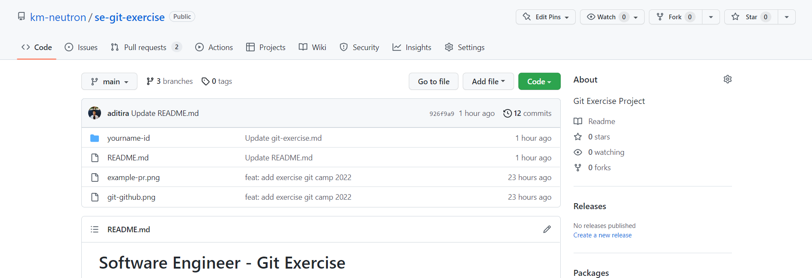
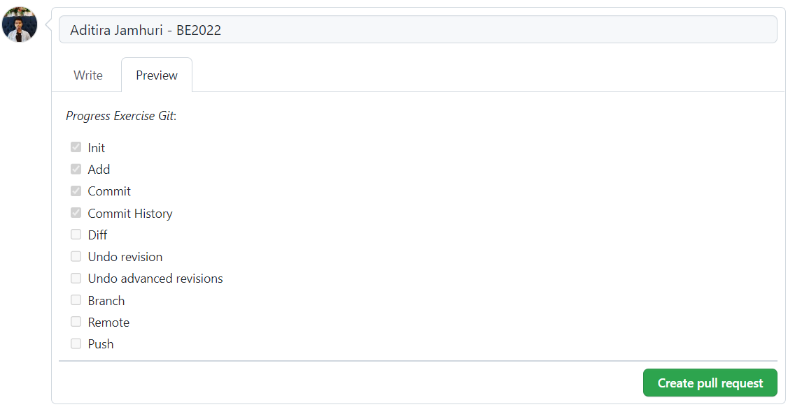

# **Software Engineer - Git Exercise**


## Objectives

- Mengerti penggunaan Git
  - init
  - add
  - commit
  - diff
  - log
  - branch
  - solve conflict
- Mengerti penggunaan Github
  - add remote
  - push
  - pull request

## Pre-requisite

- Sudah install Git di komputer local
- Sudah memiliki account Github
- Sudah mempelajari materi **Terminal**, **VSCode** dan **Version Control System**

## Directions

Untuk melihat cara mengerjakan Exercise ini, simak video demo di bawah ini:

<!-- Video Here -->

[](https://youtu.be/qCbN4dX9-_4)

Berikut adalah rangkuman dari langkah-langkah untuk mengerjakan exercise Git:

- Lakukan **cloning** repository ini ke lokal komputer mu.
- Buatlah `branch` dengan format _`name-id`_. Contoh `aditira-be2022`
- Duplicate folder **yourname-id** di repo ini, lalu rename folder tersebut dengan format _`name-id`_ (huruf kecil semua). Contoh **aditira-be2022**
- Ikuti perintah yang diminta pada file **git-exercise.md** disetiap **topic** pada point **Task** di folder duplicate yang baru dibuat (**kerjakan di luar repository ini!**)
- Berikan output yang diminta pada point **Required output** atau lakukan perintah sesuai pada point **Required command**
- Lakukan screenshot hasil dari perintah pada point _**task**_ atau _**required command**_ (screenshot harus sesuai dengan point expect dan jangan lupa harus diiringi dengan perintah `git config user.name && git config user.email`)
- Simpan image screenshot pada folder **assets** sesuai dengan alamat folder yang ada di point _screenshoot your output_ (folder sudah disiapkan) **di repository ini**.
- Seteleh selesai atau ingin update **Task** yang sudah dikerjakan, lakukan `push` repository ini lalu buat **Pull Request** dengan format:
  - **Tittle**: `<fullname>` - `<ID>`.   Contoh: Aditira Jamhuri - BE2022
  - **Description**:

    ```md
    _Progress Exercise Git_:
    - [X] Init
    - [X] Add
    - [X] Commit
    - [X] Commit History
    - [ ] Diff
    - [ ] Undo revision
    - [ ] Undo advanced revisions
    - [ ] Branch
    - [ ] Remote
    - [ ] Push
    ```

  - Contoh:

    

  - Contoh PR: click [di sini](https://github.com/km-neutron/se-git-exercise/pull/1)

  > Note: jika semua task sudah selesai untuk dikerjakan, lakukan push dan checklist semua _Progress Exercise Git_ pada description **Pull Request**

## Restrictions

- Tidak boleh menampilkan jawaban di screenshot pada **Task** yang jawab.

## Output

- Screenshot output dari setiap task yang dikerjakan
- Pull Request
- Repository Public

## Output yang harus disubmit ke LMS

- Link Pull Request (di repository ini, sesuai format)
- Link Public Repository (tugas terakhir pada file **git-exercise.md**)
