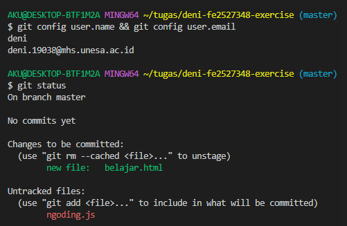
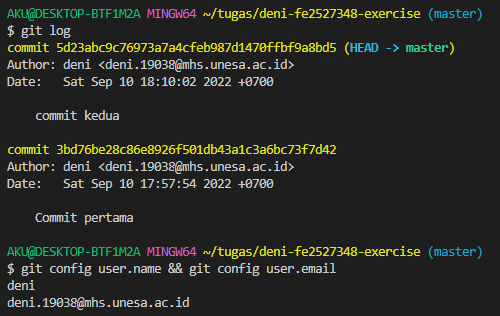
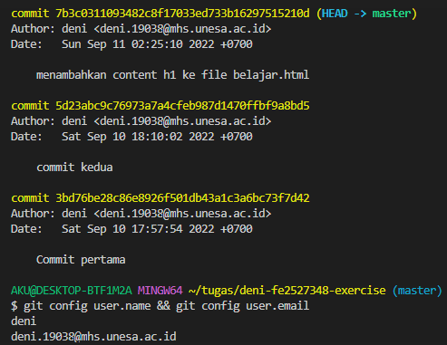
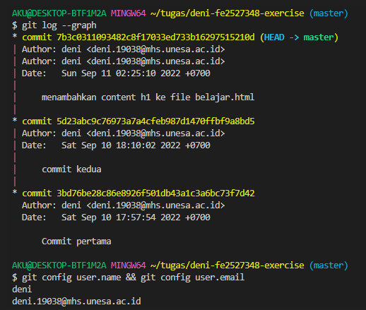
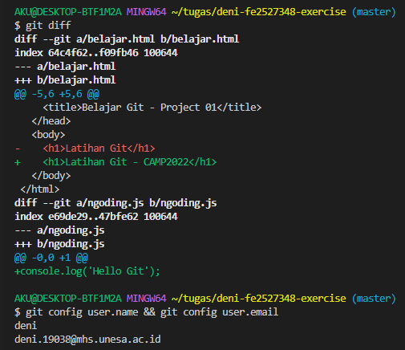
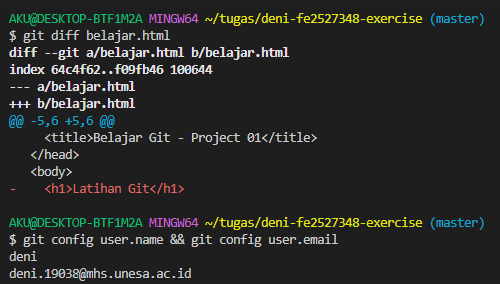
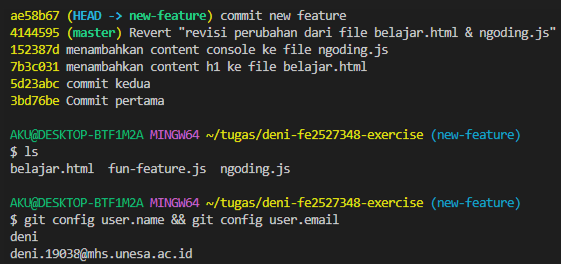
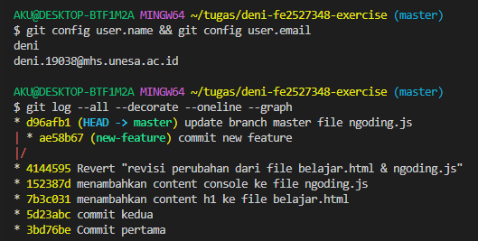
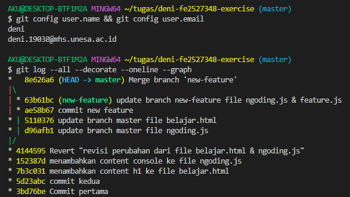
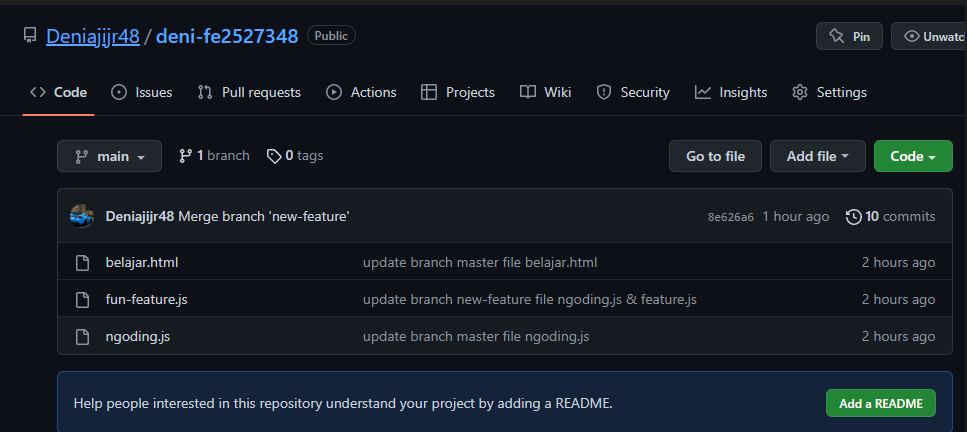

# Exercise Git and Github


## Identity

| Name | Email                      | Kelas     |
| ---- | -------------------------- | --------- |
| deni | deni.19038@mhs.unesa.ac.id | FE2527348 |

## Introduction

Kita akan melakukan practice dengan 1 repository yang dibuat. Jadi soal latihan dibawah ini akan berkelanjutan dengan repository yang sama. Jadi selamat mengerjakan! 😉

## Init

- Exercise 1

  - **Task**: Configurasi **email** dan **name** Git mu dengan identitas yang benar agar git bisa membuat `commit`!

  - **\*Required command**: lakukan perintah `git config user.name && git config user.email`:

    - expected:

      ```bash
      > git config user.name && git config user.email
      example_name
      example@gmail.com
      ```

    - screenshoot your output:

      

  > **Warning!** Selanjutnya, setiap **Required command/output** harus diiringi dengan perintah `git config user.name && git config user.email` untuk memastikan keaslian screenshot.

- Exercise 2

  - **Task**: Buatlah sebuah folder dengan format `name-id-exercise` (contoh: aditira-be2022-exercise) diluar folder **se-git-exercise** ini, masuk ke folder tersebut dan jadikan sebagai repository git!

  - **\*Required command**: lakukan perintah `pwd`, `ls -la` lalu gunakan perintah `git status`:

    - expected:

      ```bash
      > git config user.name && git config user.email
      example_name
      example@gmail.com

      > pwd
      /home/username/git-exercise

      > ls -la
      .git

      > git status
      On branch master
      Initial commit
      nothing to commit (create/copy files and use "git add" to track)
      ```

    - screenshoot your output:

      

## Add

- Exercise 1

  - **Task**: Buatlah 2 file yang bernama `belajar.html` dan `ngoding.js`!

  - **\*Required output**: lakukan perintah `ls` dan `git status`

    - expected:

      ```bash
      > git config user.name && git config user.email
      example_name
      example@gmail.com

      > ls
      belajar.html ngoding.js

      >  git status
      On branch master
      No commits yet

      Untracked files:
        (use "git add <file>..." to include in what will be committed)
            belajar.html
            ngoding.js

      nothing added to commit but untracked files present (use "git add" to track)
      ```

    - screenshoot your output:

      

- Exercise 2

  - **Task**: Setelah itu masukkan file `belajar.html` ke kondisi **staged**.

  - **\*Required output**: Periksalah status Git sekarang!.

    - expected:

      ```bash
      > git config user.name && git config user.email
      example_name
      example@gmail.com

      > git status
      On branch master
      No commits yet

      Changes to be committed:
        (use "git rm --cached <file>..." to unstage)
            new file:   belajar.html

      Untracked files:
        (use "git add <file>..." to include in what will be committed)
            ngoding.js
      ```

    - screenshoot your output:

      

    > Perhatikan keluaran dari git status, lihat file `belajar.html` pindah ke staging area.

## Commit

Sebelumnya kita sudah tau bahwa file `belajar.html` sudah berada di **staging area** dan file `ngoding.js` masih berada di **working directory**.

> Working directory adalah folder dan file yang kita miliki sekarang.

- Exercise 1

  - **Task**: Buatlah commit untuk file yang ada di **staging area** dengan pesan: `commit pertama`. Tulis pesan sama persis!

  - **\*Required command**: Lakukanlah perintah `git status`

    - expected:

      ```bash
      > git config user.name && git config user.email
      example_name
      example@gmail.com

      > git status
      On branch master
      Initial commit

      Untracked files:
        (use "git add <file>..." to include in what will be committed)
            ngoding.js
      ```

    - screenshoot your output:

      

    > Sekarang terlihat bahwa file `belajar.html` sudah tidak ada di staging area dan artinya kita sudah berhasil **commit**.

## Commit History

- Exercise 1

  - **Task**: Lakukanlah perintah Git untuk melihat **history commit** yang telah dilakukan sebelumnya!

  - **\*Required output**: Keluarkan output log dan lakukan perintah `git config --list` diakhir.

    ```bash
    commit 2860ee9930484d1ce083a6da7584834f46976715 (HEAD -> master)
    Author: Aditira Jamhuri <aditirajamhuri@gmail.com>
    Date:   Thu Jul 28 14:08:24 2022 +0700

      commit pertama

    > git config user.name && git config user.email
    example_name
    example@gmail.com
    ```

  - screenshoot your output:

    

- Exercise 2

  ```bash
  > git status
  On branch master
  Initial commit

  Untracked files:
    (use "git add <file>..." to include in what will be committed)
        ngoding.js
  ```

  - **Task**: File `ngoding.js` masih berada di **working directory**. Pindahkanlah ke **staging area** lalu commit dengan pesan "commit kedua" dan lihat history commitnya kembali!

  - **\*Required output**: Lakukan perintah `git config --list` diakhir.

    ```bash
    commit 4c6adfae4bfe7d9385589c8529f61c5f81341e78 (HEAD -> master)
    Author: Aditira Jamhuri <aditirajamhuri@gmail.com>
    Date:   Thu Jul 28 14:21:38 2022 +0700

      commit kedua

    commit 2860ee9930484d1ce083a6da7584834f46976715
    Author: Aditira Jamhuri <aditirajamhuri@gmail.com>
    Date:   Thu Jul 28 14:08:24 2022 +0700

      commit pertama

    > git config user.name && git config user.email
    example_name
    example@gmail.com
    ```

  - screenshoot your output:

    

  - **\*Required command**: Lakukanlah perintah `git status`

    - expected:

      ```bash
      > git config user.name && git config user.email
      example_name
      example@gmail.com

      > git status
      On branch master
      nothing to commit, working tree clean
      ```

    - screenshoot your output:

      

- Exercise 3

  - **Task**: Buatlah perubahan pada file `belajar.html`, dengan menambahkan content "`<h1>Latihan Git</h1>`". Lalu tambahkan perubahan tersebut ke **staging area**!

  - **\*Required command**: Lakukanlah perintah `git status`

    - expected:

      ```bash
      > git config user.name && git config user.email
      example_name
      example@gmail.com

      > git status
      On branch master
      Changes to be committed:
        (use "git restore --staged <file>..." to unstage)
          modified:   belajar.html
      ```

    - screenshoot your output:

      

    > Terlihat bahwa sekarang, file `belajar.html` sudah berada di **staging area** dengan status _modified_

- Exercise 4

  - **Task**: Buatlah commit dari perubahan diatas dengan pesan "menambahkan content h1 ke file belajar.html" lalu lihat history commitnya!

  - **\*Required output**: Lakukan perintah `git config --list` diakhir

    ```bash
    Author: Aditira Jamhuri <user.name>
    Date:   Thu Jul 28 20:47:09 2022 +0700

        menambahkan content h1 ke file belajar.html

    commit 4c6adfae4bfe7d9385589c8529f61c5f81341e78
    Author: Aditira Jamhuri <aditirajamhuri@gmail.com>
    Date:   Thu Jul 28 14:21:38 2022 +0700

        commit kedua

    commit 2860ee9930484d1ce083a6da7584834f46976715
    Author: Aditira Jamhuri <aditirajamhuri@gmail.com>
    Date:   Thu Jul 28 14:08:24 2022 +0700

        commit pertama

    > git config user.name && git config user.email
    example_name
    example@gmail.com
    ```

  - screenshoot your output:

    

- Exercise 5

  - **Task:** Lakukan perintah Git untuk melihat history commit hanya pada file `belajar.html`!

  - **\*Required output**: Lakukan perintah `git config --list` diakhir

    ```bash
    commit 5c22cd31192f8fad12cb667695569a09f64fb6f7 (HEAD -> master)
    Author: Aditira Jamhuri <user.name>
    Date:   Thu Jul 28 20:47:09 2022 +0700

        menambahkan content h1 ke file belajar.html

    commit 2860ee9930484d1ce083a6da7584834f46976715
    Author: Aditira Jamhuri <aditirajamhuri@gmail.com>
    Date:   Thu Jul 28 14:08:24 2022 +0700

        commit pertama

    > git config user.name && git config user.email
    example_name
    example@gmail.com
    ```

  - screenshoot your output:

    

- Exercise 6

  - **Task:** Lakukan perintah Git untuk melihat history commit hanya satu baris per-commit!

  - **\*Required output**: Lakukan perintah `git config --list` diakhir

    ```bash
    5c22cd3 (HEAD -> master) menambahkan content h1 ke file belajar.html
    4c6adfa commit kedua
    2860ee9 commit pertama

    > git config user.name && git config user.email
    example_name
    example@gmail.com
    ```

  - screenshoot your output:

    

- Exercise 7

  - **Task:** Lakukan perintah Git untuk melihat history commit dengan menampilkan pointer pada setiap commit-nya!

  - **\*Required output**: Lakukan perintah `git config --list` diakhir

    ```bash
    * commit 5c22cd31192f8fad12cb667695569a09f64fb6f7 (HEAD -> master)
    | Author: Aditira Jamhuri <user.name>
    | Date:   Thu Jul 28 20:47:09 2022 +0700
    |
    |     menambahkan content h1 ke file belajar.html
    |
    * commit 4c6adfae4bfe7d9385589c8529f61c5f81341e78
    | Author: Aditira Jamhuri <aditirajamhuri@gmail.com>
    | Date:   Thu Jul 28 14:21:38 2022 +0700
    |
    |     commit kedua
    |
    * commit 2860ee9930484d1ce083a6da7584834f46976715
      Author: Aditira Jamhuri <aditirajamhuri@gmail.com>
      Date:   Thu Jul 28 14:08:24 2022 +0700

          commit pertama

    > git config user.name && git config user.email
    example_name
    example@gmail.com
    ```

  - screenshoot your output:

    

- Exercise 8

  - **Task:** Cobalah kamu pindah ke commit yang pertama kali! Dan coba tampilkan history commit nya dengan kombinasi satu baris dan menampilkan pointer!

  - **\*Required output**: Lakukan perintah `git config --list` diakhir

    ```bash
    * 2860ee9 (HEAD) commit pertama

    > git config user.name && git config user.email
    example_name
    example@gmail.com
    ```

  - screenshoot your output:

    

  - **Task:** Coba pindah kembali ke posisi commit terbaru!

  - **\*Required output**: Lakukan perintah `git config --list` diakhir

    ```bash
    * 5c22cd3 (HEAD -> master) menambahkan content h1 ke file belajar.html
    * 4c6adfa commit kedua
    * 2860ee9 commit pertama

    > git config user.name && git config user.email
    example_name
    example@gmail.com
    ```

  - screenshoot your output:

    

## Diff

- Exercise 1

  - **Task:** Ubahlah isi dari file `belajar.html` menjadi "`<h1>Latihan Git - CAMP2022</h1>`" dan juga tambahkan juga isi file `ngoding.js` menjadi "console.log('Hello Git')", dan coba lihat perubahan tersebut menggunakan `diff`!

  - **\*Required output**: Lakukan perintah `git config --list` diakhir

    - expected:

      ```bash
      diff --git a/belajar.html b/belajar.html
      index 10278a7..af951a9 100644
      --- a/belajar.html
      +++ b/belajar.html
      @@ -1 +1 @@
      -<h1>Latihan Git</h1>
      +<h1>Latihan Git - CAMP2022</h1>
      diff --git a/ngoding.js b/ngoding.js
      index e69de29..4997259 100644
      --- a/ngoding.js
      +++ b/ngoding.js
      @@ -0,0 +1 @@
      +console.log('Hello Git')

      > git config user.name && git config user.email
      example_name
      example@gmail.com
      ```

    - screenshoot your output:

      

- Exercise 2

  - **Task:** Coba sekarang lihat diff namun hanya untuk melihat perubahan pada file `belajar.html`!

  - **\*Required output**: Lakukan perintah `git config --list` diakhir

    - expected:

      ```bash
      diff --git a/belajar.html b/belajar.html
      index 10278a7..af951a9 100644
      --- a/belajar.html
      +++ b/belajar.html
      @@ -1 +1 @@
      -<h1>Latihan Git</h1>
      +<h1>Latihan Git - CAMP2022</h1>

      > git config user.name && git config user.email
      example_name
      example@gmail.com
      ```

    - screenshoot your output:

      

## Undo revision

```bash
> git status
On branch master
Changes not staged for commit:
  (use "git add <file>..." to update what will be committed)
  (use "git restore <file>..." to discard changes in working directory)
        modified:   belajar.html
        modified:   ngoding.js

no changes added to commit (use "git add" and/or "git commit -a")
```

Terlihat diatas bahwa terjadi perubahan file pada `belajar.html` dan `ngoding.html` di **working directory** kita

- Exercise 1

  - **Task:** Coba masukan semua perubahan tersebut sekaligus ke **staging area**!

  - **\*Required command**: Lakukanlah perintah `git status` kembali

    - expected:

      ```bash
      > git config user.name && git config user.email
      example_name
      example@gmail.com

      > git status
      On branch master
      Changes to be committed:
        (use "git restore --staged <file>..." to unstage)
          modified:   belajar.html
          modified:   ngoding.js
      ```

    - screenshoot your output:

      

- Exercise 2

  - **Task:** Lakukan pembatalan perubahan pada file `ngoding.js` di **staging area** agar kembali ke **working directory** untuk kita revisi!

  - **\*Required command**: Lakukanlah perintah `git status` kembali

    - expected:

      ```bash
      > git config user.name && git config user.email
      example_name
      example@gmail.com

      > git status
      On branch master
      Changes to be committed:
        (use "git restore --staged <file>..." to unstage)
              modified:   belajar.html

      Changes not staged for commit:
        (use "git add <file>..." to update what will be committed)
        (use "git restore <file>..." to discard changes in working directory)
              modified:   ngoding.js
      ```

    - screenshoot your output:

      

- Exercise 3

  - **Task:** Lakukan perubahan pada file `ngoding.js` dengan mengubah contentnya menjadi "`console.log('Latihan Git - CAMP2022')`"!. Lalu masukan ke **staging area** dan lakukan commit dengan pesan "menambahkan content console ke file `ngoding.js`"!

  - **\*Required command**: Lakukanlah perintah `git status` kembali

    - expected:

      ```bash
      > git config user.name && git config user.email
      example_name
      example@gmail.com

      > git status
      On branch master
      nothing to commit, working tree clean
      ```

    - screenshoot your output:

      

## Undo advanced revisions

```bash
88b656e (HEAD -> master) menambahkan content console ke file ngoding.js
5c22cd3 menambahkan content h1 ke file belajar.html
4c6adfa commit kedua
2860ee9 commit pertama
```

Sekarang story commit kita sudah ada 4 pointer yang berisi setiap perubahan pada file yang kita kerjakan.

- Exercise 1

  - **Task:** Bagaimana jika perubahan yang sudah kita commit ingin di revisi? Secara history, commit kita tidak akan bisa dihapus. Namun kita bisa mengembalikan commit sebelumnya ke commit berikutnya dengan melakukan `revert`. Cobalah revert perubahan id `88b656e` ke commit berikutnya!

  - **\*Required command**: Lakukan perintah untuk menampilkan history commit dengan opsi `oneline` dan lakukan `cat` pada file `belajar.html` dan `ngoding.js`

    - expected:

      ```bash
      6a2659e (HEAD -> master) Revert "revisi perubahan dari file belajar.html & ngoding.js"
      88b656e menambahkan content console ke file ngoding.js
      5c22cd3 menambahkan content h1 ke file belajar.html
      4c6adfa commit kedua
      2860ee9 commit pertama

      > cat belajar.html
      <h1>Latihan Git</h1>
      > cat ngoding.js
      >

      > git config user.name && git config user.email
      example_name
      example@gmail.com
      ```

    - screenshoot your output:

      

> Kita lihat bahwa file `belajar.html` dan `ngoding.js` kembali ke kondisi di commit `88b656e`

## Branch

```bash
> git branch
* master
> git status
On branch master
nothing to commit, working tree clean
```

Jika diperhatikan dengan `git status` kita sekarang berada pada branch `master`

- Exercise 1

  - **Task:** Buatlah branch baru dengan nama `new-feature`, lalu masuklah ke branch baru tersebut!.

  - **\*Required command**: Lakukanlah perintah `git branch` dan `git status`

    - expected:

      ```bash
      > git config user.name && git config user.email
      example_name
      example@gmail.com

      > git branch
        master
      * new-feature

      > git status
      On branch new-feature
      nothing to commit, working tree clean
      ```

    - screenshoot your output:

      

- Exercise 2

  - **Task:** Sekarang kita sudah berada di branch `new-feature`. Cobalah buat satu file yang bernama `fun-feature.js`, tambahkan ke **staging area** dan lakukan commit dengan pesan "commit new feature"!

  - **\*Required output**: Lakukan perintah untuk menampilkan history commit kombinasi `oneline` dan `graph`, lalu lakukan perintah `ls`

    - expected:

      ```bash
      * bd531c8 (HEAD -> new-feature) commit new feature
      * 6a2659e Revert (master) "revisi perubahan dari file belajar.html & ngoding.js"
      * 88b656e menambahkan content console ke file ngoding.js
      * 5c22cd3 menambahkan content h1 ke file belajar.html
      * 4c6adfa commit kedua
      * 2860ee9 commit pertama

      > ls
      belajar.html fun-feature.js ngoding.js

      > git config user.name && git config user.email
      example_name
      example@gmail.com
      ```

    - screenshoot your output:

      

- Exercise 3

  - **Task:** Cobalah pindah kembali ke branch `master`! dan coba check file `fun-feature.js` apakah ada di branch master?.

  - **\*Required command**: Lakukan perintah `git status`, `git branch` dan `ls`

    - expected:

      ```bash
      > git config user.name && git config user.email
      example_name
      example@gmail.com

      > git status
      On branch master
      nothing to commit, working tree clean

      > git branch
      * master
        new-feature

      > ls
      belajar.html  ngoding.js
      ```

    - screenshoot your output:

      

    > Jadi begitulah sebuah branch pada Git. Dia melakukan isolasi setiap perubahan pada file dan folder berdasarkan branch nya.

- Exercise 4

  - **Task:** Di branch `master`, coba kamu lakukan penambahan content pada file `ngoding.js` yaitu "console.log('Update branch master')" dan lakukan commit dengan pesan "update branch master file ngoding.js"!

  - **\*Required command**: Lakukan perintah `git log --all --decorate --oneline --graph` untuk melihat percabangan yang terjadi

    - expected:

      ```bash
      > git config user.name && git config user.email
      example_name
      example@gmail.com

      > git log --all --decorate --oneline --graph
      * d940eb9 (HEAD -> master) update branch master file ngoding.js
      | * bd531c8 (new-feature) commit new feature
      |/
      * 6a2659e Revert "revisi perubahan dari file belajar.html & ngoding.js"
      * 88b656e menambahkan content console ke file ngoding.js
      * 5c22cd3 menambahkan content h1 ke file belajar.html
      * 4c6adfa commit kedua
      * 2860ee9 commit pertama
      ```

    - screenshoot your output:

      

  > Disini terlihat bahwa sudah terjadi percabangan pada branch `master` dengan `new-feature`

- Exercise 5

  - **Task:** Lakukan penambahan content pada file `belajar.html` yaitu "`<h1>`Update branch master`</h1>`" dan lakukan commit dengan pesan "update branch master file belajar.html"!

  - **\*Required command**: Lakukan perintah `git log --all --decorate --oneline --graph` untuk melihat percabangan yang terjadi

  - expected:

    ```bash
    > git config user.name && git config user.email
    example_name
    example@gmail.com

    > git log --all --decorate --oneline --graph
    * bf84c9a (HEAD -> master) update branch master file belajar.html
    * d940eb9 update branch master file ngoding.js
    | * bd531c8 (new-feature) commit new feature
    |/
    * 6a2659e Revert "revisi perubahan dari file belajar.html & ngoding.js"
    * 88b656e menambahkan content console ke file ngoding.js
    * 5c22cd3 menambahkan content h1 ke file belajar.html
    * 4c6adfa commit kedua
    * 2860ee9 commit pertama
    ```

    - screenshoot your output:

      

- Exercise 6

  - **Task:** Pindah ke branch `new-feature`, laukan perubahan pada file `ngoding.js` dengan menambahkan content "console.log('Update branch new-feature')" dan pada file `feature.js` dengan content "console.log('My Cool Feature')". Lakukan commit dengan pesan "update branch new-feature file ngoding.js & feature.js"!

  - **\*Required command**: Lakukan perintah `git log --all --decorate --oneline --graph` untuk melihat percabangan yang terjadi

    - expected:

      ```bash
      > git config user.name && git config user.email
      example_name
      example@gmail.com

      > git log --all --decorate --oneline --graph
      * 052dd41 (HEAD -> new-feature) update branch new-feature file ngoding.js & feature.js
      * bd531c8 commit new feature
      | * bf84c9a (master) update branch master file belajar.html
      | * d940eb9 update branch master file ngoding.js
      |/
      * 6a2659e Revert "revisi perubahan dari file belajar.html & ngoding.js"
      * 88b656e menambahkan content console ke file ngoding.js
      * 5c22cd3 menambahkan content h1 ke file belajar.html
      * 4c6adfa commit kedua
      * 2860ee9 commit pertama
      ```

    - screenshoot your output:

      

- Exercise 7

  - **Task:** Pindah ke branch `master` dan lakukan merge ke branch `new-feature`!. Harusnya terjadi conflict pada file `ngoding.js`.

    

    Solve conflict tersebut dengang memilih perubahan pada branch `master`!

  - **\*Required command**: Lakukan perintah `git log --all --decorate --oneline --graph` untuk melihat percabangan yang terjadi

    - expected:

      ```bash
      > git config user.name && git config user.email
      example_name
      example@gmail.com

      > git log --all --decorate --oneline --graph
      *   752dfaa (HEAD -> master) Merge branch 'new-feature'
      |\
      | * 052dd41 (new-feature) update branch new-feature file ngoding.js & feature.js
      | * bd531c8 commit new feature
      * | bf84c9a update branch master file belajar.html
      * | d940eb9 update branch master file ngoding.js
      |/
      * 6a2659e Revert "revisi perubahan dari file belajar.html & ngoding.js"
      * 88b656e menambahkan content console ke file ngoding.js
      * 5c22cd3 menambahkan content h1 ke file belajar.html
      * 4c6adfa commit kedua
      * 2860ee9 commit pertama
      ```

    - screenshoot your output:

      

## Remote

- Exercise 1

  - **Task:** buatlah repository **public** di profile github mun dengan format _`name-id`_. Contohnya:

    

    Lalu tambahkan **remote** dari repository yang telah dibuat, ke local repository yang sudah dibuat dengan format `name-id-exercise`!

  - **\*Required command**: Lakukan perintah `git remote -v` untuk mengetahui remote repository yang sudah ditambahkan.

    - expected:

      ```bash
      > git config user.name && git config user.email
      example_name
      example@gmail.com

      > git remote -v
      origin  https://github.com/aditira/aditira-be1255.git (fetch)
      origin  https://github.com/aditira/aditira-be1255.git (push)
      ```

    - screenshoot your output:

      

## Push

- Exercise 1

  - **Task:** Lakukanlah `push` ke remote repository yang telah ditambahkan dengan branch bernama `main`:!

  - **\*Required command**: Lakukan perintah `git log --all --decorate --oneline --graph`

    - expected:

      ```bash
      > git config user.name && git config user.email
      example_name
      example@gmail.com

      > git log --all --decorate --oneline --graph
      *   752dfaa (HEAD -> main, origin/main) Merge branch 'new-feature'
      |\
      | * 052dd41 (new-feature) update branch new-feature file ngoding.js & feature.js
      | * bd531c8 commit new feature
      * | bf84c9a update branch master file belajar.html
      * | d940eb9 update branch master file ngoding.js
      |/
      * 6a2659e Revert "revisi perubahan dari file belajar.html & ngoding.js"
      * 88b656e menambahkan content console ke file ngoding.js
      * 5c22cd3 menambahkan content h1 ke file belajar.html
      * 4c6adfa commit kedua
      * 2860ee9 commit pertama
      ```

    - screenshoot your output:

      

**\*Last requirement**: sreenshoot private repository github mu:

- expected:

  

- screenshoot your repository Github:

  

- url repository github _(change `url` with your public repository Github)_: [github](url)

Finish.

> **Last Instruction**: Jangan lupa, setelah semua screenshot terisi, lakukan push pada repository dan checklist semua _Progress Exercise Git_ pada description **Pull Request** sesuai dengan instruksi README.md.
